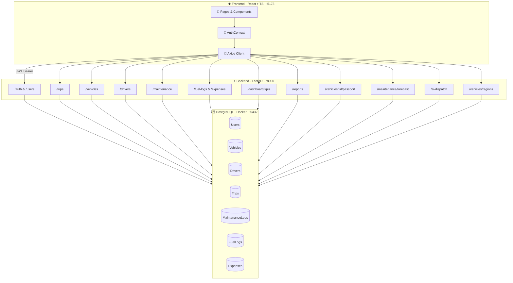
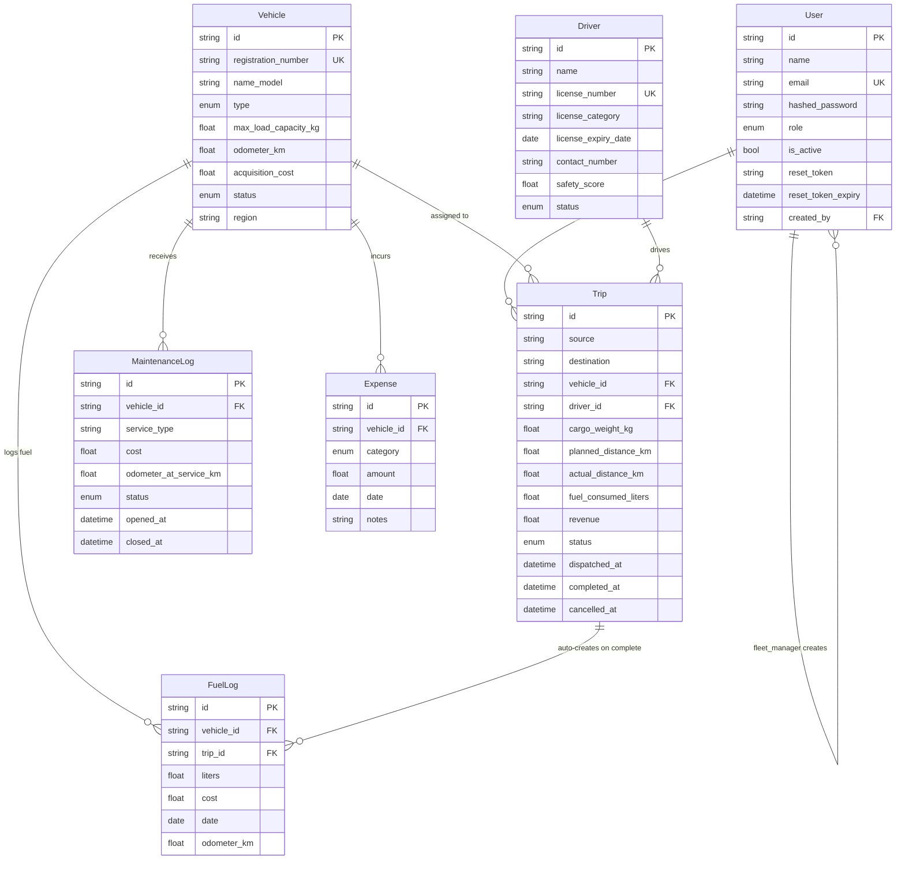

<div align="center">

  <!-- Odoo Hackathon Banner -->
  
  <br />
  <sub>Hackathon 2026 · Smart Transport Operations Challenge</sub>

  <br /><br />

  <!-- Project Title -->
  <picture>
    <source media="(prefers-color-scheme: dark)" srcset="https://readme-typing-svg.demolab.com?font=Fira+Code&weight=700&size=36&duration=3000&pause=1000&color=4FC3F7&center=true&vCenter=true&width=500&lines=%F0%9F%9A%9B+TransitOps" />
    
  </picture>

  <h3>Smart Transport Operations Platform</h3>

  <p>
    <em>End-to-end fleet management — vehicles, drivers, dispatch, maintenance, fuel tracking, and real-time analytics.</em>
    <br />
    <em>Built in <strong>8 hours</strong> by <strong>3 developers</strong> for the Odoo Hackathon 2026.</em>
  </p>

  <br />

  <!-- Hackathon Badges -->
  <a href="https://www.odoo.com"></a>
  
  

  <br /><br />

  <!-- Tech Badges -->
  
  
  
  
  
  
  
  

  <br /><br />

  <!-- Quick Links -->
  <a href="#-getting-started"><strong>🚀 Quick Start</strong></a> · 
  <a href="#-features"><strong>✨ Features</strong></a> · 
  <a href="#-api-documentation"><strong>📖 API Docs</strong></a> · 
  <a href="#-demo-credentials"><strong>🔑 Demo Login</strong></a>

</div>

<br />

---

<br />

> [!NOTE]
> **🏆 Odoo Hackathon 2026 Submission** — This project was built entirely within an 8-hour hackathon window. The challenge was set by [Odoo](https://www.odoo.com): build a production-ready transport operations platform that digitizes vehicle, driver, dispatch, maintenance, and expense management — all with enforced business rules and operational analytics.

<br />

## 📑 Table of Contents

<details>
<summary><strong>Click to expand</strong></summary>

<br />

- [Overview](#-overview)
- [Hackathon Context](#-hackathon-context)
- [Features](#-features)
- [Tech Stack](#-tech-stack)
- [Architecture](#-architecture)
- [Data Model](#-data-model)
- [Business Rules](#-business-rules)
- [RBAC Matrix](#-rbac-matrix)
- [Project Structure](#-project-structure)
- [Getting Started](#-getting-started)
- [Demo Credentials](#-demo-credentials)
- [Running Tests](#-running-tests)
- [API Documentation](#-api-documentation)
- [Security](#-security)
- [Team](#-team)
- [License](#-license)

</details>

<br />

## 🔍 Overview

<table>
<tr>
<td width="33%">

### 🔴 The Problem

Logistics companies rely on **spreadsheets**, WhatsApp groups, and paper logbooks. This causes:

- Scheduling conflicts
- Underutilized vehicles
- Missed maintenance
- Expired driver licenses
- Inaccurate expense tracking
- **Zero operational visibility**

</td>
<td width="33%">

### 🟢 The Solution

**TransitOps** is a centralized platform managing the complete lifecycle:

- Vehicle registration & tracking
- Driver onboarding & compliance
- Automated trip dispatch
- Maintenance scheduling
- Fuel & expense logging
- **Real-time analytics**

</td>
<td width="33%">

### 🔵 The Context

Built in **8 hours** for the Odoo Hackathon 2026 by **3 developers**.

- ✅ 9 mandatory features shipped
- ⚡ 4 X-Factor features beyond scope
- 🔒 10 business rules enforced
- 🛡️ 4-role RBAC system
- 📧 Real Gmail OTP integration
- 🐳 One-command Docker deploy

</td>
</tr>
</table>

<br />

## 🏆 Hackathon Context

<div align="center">

| | Detail |
|:---:|--------|
| 🏢 | **Organized by** [Odoo](https://www.odoo.com) |
| 🏆 | **Challenge:** Smart Transport Operations Platform |
| ⏱️ | **Duration:** 8 hours (09:00 – 16:30) |
| 👥 | **Team size:** 3 members |
| 🎯 | **Scope:** Auth, Fleet CRUD, Dispatch, Maintenance, Fuel, Analytics |
| ⚡ | **Bonus:** 4 X-Factor features beyond problem statement |

</div>

<br />

## ✨ Features

### 📋 Mandatory Features <sub>(from Odoo problem statement)</sub>

| # | Feature | Description |
|:---:|---------|-------------|
| `01` | **🔐 Authentication & RBAC** | JWT login, forgot password with Gmail OTP, 4 roles, server-side enforcement on every endpoint |
| `02` | **👥 Multi-User Management** | Fleet Manager creates users across all roles from the UI — no DB access needed |
| `03` | **🚛 Vehicle Registry** | Full CRUD — unique registration, type, capacity, odometer, cost, status lifecycle |
| `04` | **🧑‍✈️ Driver Management** | License validity tracking, safety scores, status management |
| `05` | **🗺️ Trip Management** | Draft → Dispatched → Completed/Cancelled with auto status transitions + dual-point validation |
| `06` | **🔧 Maintenance Workflow** | Auto moves vehicles to In Shop; closing restores availability |
| `07` | **⛽ Fuel & Expenses** | Per-trip fuel logs, category-based expenses, auto-computed operational cost |
| `08` | **📊 Dashboard & KPIs** | Real-time metrics with filters by vehicle type, status, and region |
| `09` | **📈 Reports & Analytics** | Fuel Efficiency, Fleet Utilization, Operational Cost, Vehicle ROI + CSV export |

### ⚡ X-Factor Features <sub>(beyond problem statement)</sub>

| # | Feature | What Makes It Special |
|:---:|---------|-------------|
| `⚡1` | **📄 Digital Vehicle Passport** | Single endpoint aggregating a vehicle's entire lifecycle — trips, maintenance, fuel, expenses, compliance timeline, and summary stats |
| `⚡2` | **🔮 Predictive Maintenance** | Heuristic forecasting via 3 signals: odometer interval (10k km), time interval (180 days), and recurring service patterns |
| `⚡3` | **🤖 AI Dispatch Recommendation** | Scoring engine ranking vehicle+driver pairs by safety, efficiency, load compatibility, region proximity, and maintenance recency |
| `⚡4` | **🗺️ Interactive Fleet Map** | Region-grouped vehicle status with live breakdown (available, on trip, in shop) per region |

<br />

## 🛠️ Tech Stack

<div align="center">

```
╔═══════════════════════════════════════════════════════╗
║                   TRANSITOPS STACK                    ║
╠═══════════════╦═══════════════════════════════════════╣
║               ║  React 18 + TypeScript + Vite         ║
║   FRONTEND    ║  Axios (JWT interceptor + 401 guard)  ║
║   :5173       ║  React Router v6                      ║
║               ║  Recharts (KPI charts + analytics)    ║
╠═══════════════╬═══════════════════════════════════════╣
║               ║  FastAPI (Python 3.11)                ║
║   BACKEND     ║  SQLAlchemy 2.x ORM                  ║
║   :8000       ║  Pydantic v2 (validation + schemas)  ║
║               ║  python-jose (JWT) + bcrypt           ║
║               ║  Gmail SMTP (OTP + email reset)       ║
╠═══════════════╬═══════════════════════════════════════╣
║   DATABASE    ║  PostgreSQL 16 (Docker)               ║
║   :5432       ║  Named volume (persistent data)       ║
╠═══════════════╬═══════════════════════════════════════╣
║               ║  Docker + Docker Compose (3 services) ║
║   DEVOPS      ║  Pytest (unit + integration)          ║
║               ║  PowerShell E2E suite (~60 tests)     ║
╚═══════════════╩═══════════════════════════════════════╝
```

</div>

<br />

## 🏗️ Architecture



<br />

## 📐 Data Model

<details>
<summary><strong>Click to expand Entity Relationship Diagram</strong></summary>

<br />



</details>

<br />

## 📏 Business Rules

> All 10 rules are enforced **server-side** with clean 4xx responses. The UI is supplementary — not the enforcement layer.

| # | Rule | When | Response |
|:---:|------|:----:|:--------:|
| 1 | Vehicle registration number must be unique | Create | `409` |
| 2 | Retired / In Shop vehicles cannot be dispatched | Create + Dispatch | `400` |
| 3 | Expired license or Suspended drivers cannot be assigned | Create + Dispatch | `400` |
| 4 | Vehicle or driver already On Trip cannot be double-assigned | Create + Dispatch | `400` |
| 5 | Cargo weight must not exceed vehicle max capacity | Create | `400` |
| 6 | Dispatching → vehicle + driver status = **On Trip** | Dispatch | Auto |
| 7 | Completing → both restored to **Available** + FuelLog created | Complete | Auto |
| 8 | Cancelling dispatched trip → both restored to **Available** | Cancel | Auto |
| 9 | Opening maintenance → vehicle status = **In Shop** | Open | Auto |
| 10 | Closing maintenance → vehicle restored to **Available** | Close | Auto |

> [!WARNING]
> **Rules 3 and 4 are validated at both trip creation AND dispatch** — a race-condition guard ensuring state changes between steps cannot bypass enforcement.

<br />

## 🛡️ RBAC Matrix

<div align="center">

| Action | 🔑 Fleet Manager | 🚗 Driver | 🛡 Safety Officer | 💰 Financial Analyst |
|--------|:---:|:---:|:---:|:---:|
| Create / manage users | ✅ | — | — | — |
| Vehicle CRUD | ✅ | 👁 | 👁 | 👁 |
| Driver CRUD | ✅ | — | ✅ | 👁 |
| Create Trip | ✅ | ✅ | — | — |
| Dispatch / Cancel Trip | ✅ | — | — | — |
| Complete Trip | ✅ | ✅ Own | — | — |
| View Trips | ✅ All | ✅ Own | ✅ All | ✅ All |
| Maintenance | ✅ | — | — | — |
| Fuel Logs / Expenses | ✅ | ✅ Own | — | ✅ |
| Dashboard | ✅ | ✅ | ✅ | ✅ |
| Reports | ✅ | — | ✅ | ✅ |
| Vehicle Passport | ✅ | ✅ | ✅ | ✅ |
| Predictive Maintenance | ✅ | — | ✅ | — |
| AI Dispatch | ✅ | — | — | — |
| Fleet Map | ✅ | ✅ | ✅ | ✅ |

</div>

<br />

## 📁 Project Structure

<details>
<summary><strong>Click to expand full directory tree</strong></summary>

```
transitops/
├── backend/
│   ├── app/
│   │   ├── main.py              # FastAPI app, CORS, lifespan, router registration
│   │   ├── config.py            # Pydantic settings (env vars, Gmail SMTP)
│   │   ├── database.py          # SQLAlchemy engine, session, Base
│   │   ├── models.py            # All ORM models + enums
│   │   ├── schemas.py           # Pydantic v2 request/response schemas
│   │   ├── security.py          # bcrypt, JWT, OTP generation, Gmail SMTP
│   │   ├── deps.py              # get_current_user, require_role dependencies
│   │   ├── seed.py              # Seeds 4 demo users + example workflow data
│   │   └── routers/
│   │       ├── auth.py          # Login, register, forgot-password, OTP, reset
│   │       ├── vehicles.py      # Vehicle CRUD + filters
│   │       ├── drivers.py       # Driver CRUD + compliance
│   │       ├── trips.py         # Trip lifecycle + business rules 2–8
│   │       ├── maintenance.py   # Maintenance open/close + rules 9–10
│   │       ├── fuel_expense.py  # Fuel logs, expenses, operational cost
│   │       ├── dashboard.py     # KPI aggregation with filters
│   │       ├── reports.py       # Analytics + CSV export
│   │       ├── passport.py      # ⚡ Digital Vehicle Passport
│   │       ├── predictive.py    # ⚡ Predictive Maintenance Engine
│   │       ├── ai_dispatch.py   # ⚡ AI Dispatch Recommendation
│   │       └── fleet_map.py     # ⚡ Interactive Fleet Map
│   ├── requirements.txt
│   ├── Dockerfile
│   └── .env.example
├── frontend/
│   ├── src/
│   │   ├── api/client.ts        # Axios instance, JWT injection, 401 interceptor
│   │   ├── context/AuthContext.tsx
│   │   ├── components/          # Layout, Sidebar, KPICard, StatusBadge, Modal
│   │   └── pages/               # Login, Dashboard, Vehicles, Drivers, Trips, etc.
│   ├── package.json
│   ├── vite.config.ts
│   └── Dockerfile
├── testscripts/
│   ├── backend/                 # Pytest test modules
│   ├── Test-TransitOps.ps1      # Full PowerShell E2E suite (~60 tests)
│   └── Run-Tests.ps1            # Launcher script
├── docker-compose.yml
├── .gitignore
└── README.md
```

</details>

<br />

## 🚀 Getting Started

### Prerequisites

| Tool | Required |
|------|----------|
| 🐳 Docker Desktop | Docker Engine + Compose v2 |
| 💻 Git | Any recent version |
| 📝 PowerShell 7+ | For test suite only |

### One-Command Deploy

```bash
git clone https://github.com/amshithnair/transitops-odoo.git
cd transitops-odoo
cp .env.example .env       # add your Gmail SMTP credentials
docker compose up --build
```

> No manual database setup. No Python environment. No `npm install`. Just Docker.

### Service Endpoints

| Service | URL | Description |
|---------|-----|-------------|
| 🌐 Frontend | [`localhost:5173`](http://localhost:5173) | React application |
| ⚡ Backend | [`localhost:8000`](http://localhost:8000) | FastAPI server |
| 📖 Swagger | [`localhost:8000/docs`](http://localhost:8000/docs) | Interactive API docs |
| 📄 ReDoc | [`localhost:8000/redoc`](http://localhost:8000/redoc) | Alternative API docs |

### Environment Variables

<details>
<summary><strong>Click to see <code>.env</code> template</strong></summary>

```env
# Database (auto-configured by Docker Compose)
DATABASE_URL=postgresql+psycopg2://transitops:transitops@db:5432/transitops

# JWT
JWT_SECRET=your-strong-secret-key-here
JWT_ALGORITHM=HS256
ACCESS_TOKEN_EXPIRE_MINUTES=480

# Gmail SMTP (use App Password, not account password)
# Generate at: Google Account → Security → 2-Step Verification → App Passwords
SMTP_SERVER=smtp.gmail.com
SMTP_PORT=587
SMTP_USER=your-fleet-email@gmail.com
SMTP_PASSWORD=xxxx-xxxx-xxxx-xxxx
SMTP_FROM_EMAIL=transitops@yourdomain.com

# Frontend
FRONTEND_URL=http://localhost:5173
```

</details>

<br />

## 🔑 Demo Credentials

Seeded automatically on first startup — **no setup required**:

| Role | Email | Password | Scope |
|:----:|-------|----------|-------|
| 🔑 Fleet Manager | `fleet@transitops.com` | `Fleet@123` | **Full access** — all CRUD, dispatch, analytics, user management |
| 🚗 Driver | `driver@transitops.com` | `Driver@123` | Own trips, fuel logs, dashboard |
| 🛡 Safety Officer | `safety@transitops.com` | `Safety@123` | Compliance monitoring, reports, predictive maintenance |
| 💰 Financial Analyst | `finance@transitops.com` | `Finance@123` | Expenses, fuel costs, ROI reports |

> [!TIP]
> **For jury demos:** Log in as Fleet Manager → **Settings** → **User Management** → create additional users with any role. No database access needed.

### Pre-seeded Data

- 🚛 **3 vehicles** — VAN-05 (Ford Transit), TRK-12 (Volvo FH16), VAN-03 (Mercedes Sprinter)
- 🧑‍✈️ **3 drivers** — Alex Johnson, Maria Garcia, James Chen (varied license categories + safety scores)
- 📊 All reports, ROI, and Vehicle Passport ready to populate with operational data

<br />

## 🧪 Running Tests

### PowerShell E2E Suite

```powershell
# Ensure Docker stack is running first
.\testscripts\Run-Tests.ps1
```

```
========================================
  TransitOps Full Feature Test Suite
========================================
[PASS] Backend health check responds
[PASS] Login fleet manager (200 + token)
[PASS] Rule 5: Cargo > capacity returns 400
[PASS] Rule 9: Vehicle → In Shop after maintenance
[PASS] Vehicle passport includes compliance_timeline
...
  PASSED : 60 / 60 ✅
========================================
```

### Pytest

```bash
cd testscripts && python -m pytest backend/ -v
```

<br />

## 📖 API Documentation

Interactive docs at **[localhost:8000/docs](http://localhost:8000/docs)** (Swagger) and **[localhost:8000/redoc](http://localhost:8000/redoc)** (ReDoc).

| Group | Key Endpoints | Purpose |
|-------|--------------|---------|
| **Auth** | `POST /auth/login` · `/register` · `/forgot-password` · `/verify-otp` · `/reset-password` | Authentication + OTP reset |
| **Users** | `POST /users` · `GET /users` | Fleet Manager user management |
| **Vehicles** | `GET/POST /vehicles` · `PATCH /vehicles/{id}` | Vehicle registry |
| **Drivers** | `GET/POST /drivers` · `PATCH /drivers/{id}` | Driver management |
| **Trips** | `POST /trips` · `/trips/{id}/dispatch` · `/complete` · `/cancel` | Trip lifecycle |
| **Maintenance** | `POST /maintenance` · `/maintenance/{id}/close` | Maintenance workflow |
| **Fuel & Expenses** | `POST /fuel-logs` · `POST /expenses` | Financial tracking |
| **Dashboard** | `GET /dashboard/kpis` | Real-time KPIs |
| **Reports** | `GET /reports/fuel-efficiency` · `/utilization` · `/cost` · `/roi` | Analytics + CSV |
| **⚡ Passport** | `GET /vehicles/{id}/passport` | Digital Vehicle Passport |
| **⚡ Predictive** | `GET /maintenance/forecast/{id}` | Maintenance forecasting |

<br />

## 🔒 Security

| Layer | Implementation |
|-------|---------------|
| 🔐 JWT Tokens | Contains only `sub`, `role`, `exp` — no PII in payload |
| 🔑 Passwords | bcrypt hashed (cost factor 12) — never stored in plain text |
| 📧 OTP Flow | 6-digit code → SHA256 hash → 15-min expiry → 2-step reset |
| 🌐 CORS | Scoped to `localhost:5173` only — not wildcard `*` |
| 🛡 RBAC | Server-side via `Depends()` on every mutating endpoint |
| 👁 Ownership | Drivers query only their own trips at the DB level |
| 🚫 Error Handling | Clean 4xx messages — no stack traces leaked to client |

<br />

## 👥 Team

<div align="center">

| Role | Focus Areas |
|:----:|-------------|
| **🎯 Lead** | System design · Auth + RBAC · Trip lifecycle · Maintenance workflow · Digital Vehicle Passport · Predictive Maintenance · Security audit · QA |
| **⚙️ Backend Dev** | Vehicle Registry · Driver Management · Fuel & Expense · Dashboard KPIs · Reports & CSV · AI Dispatch · Fleet Map |
| **🎨 Frontend Dev** | All React pages · AuthContext · Axios client · RBAC-aware routing · KPI charts · Region cards |

</div>

<br />

## 📄 License

This project is licensed under the **MIT License** — see the [`LICENSE`](LICENSE) file for details.

<br />

---

<div align="center">

  <br />

  

  <br /><br />

  <strong>Built with Love ❤️ by the TransitOps Team</strong>

  <br />

  <sub>Odoo Hackathon 2026 · 8 Hours · 3 Developers · 1 Platform · ∞ Possibilities</sub>

  <br /><br />

  <a href="https://www.odoo.com">
    
  </a>

  <br /><br />

</div>
