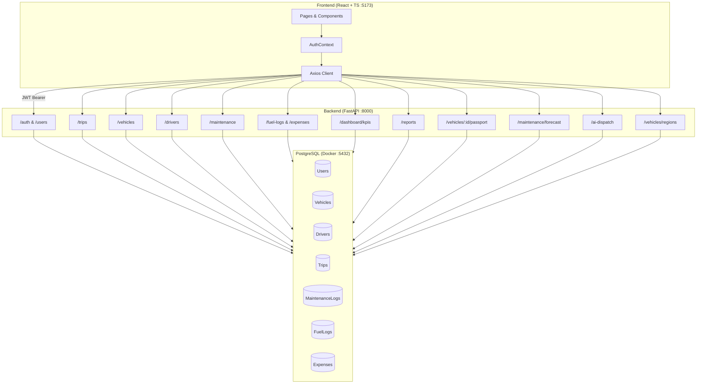
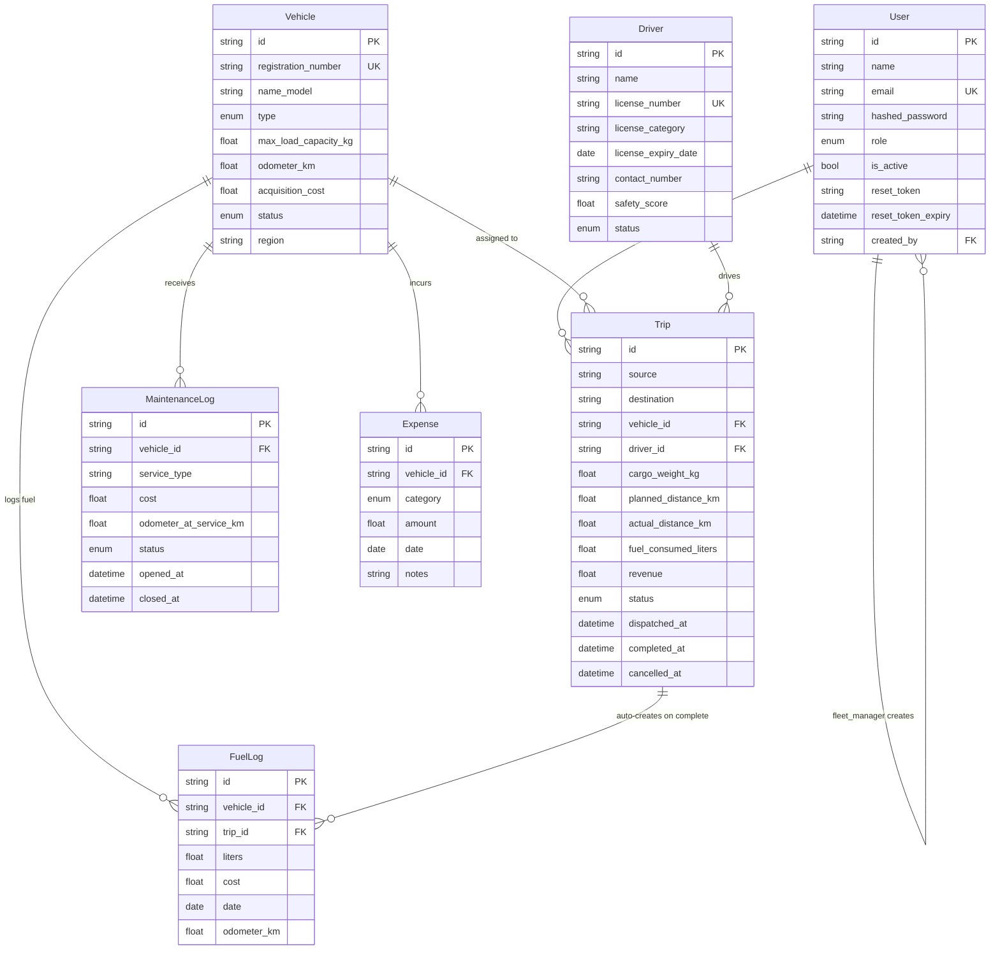

# TransitOps Fleet Operations Platform
<div align="center">
> Fleet operations platform — full content coming.
  
  <br /><br />
  <h1>🚛 TransitOps</h1>
  <p><strong>Smart Transport Operations Platform</strong></p>
  <p>End-to-end fleet management — vehicles, drivers, dispatch, maintenance, fuel, and analytics in one platform.</p>
  <br />
  
  
  
  <br /><br />
  
  
  
  
  
  
  
  
</div>
---
> 🏆 **Odoo Hackathon 2026 Submission**
> Built in 8 hours by a team of 3. Challenge set by Odoo — objective: build an end-to-end transport operations platform that digitizes vehicle, driver, dispatch, maintenance, and expense management while enforcing business rules and providing operational insights.
---
## 📑 Table of Contents
- [Overview](#overview)
- [Hackathon Context](#hackathon-context)
- [Features](#features)
  - [Mandatory Features](#mandatory-features-from-odoo-problem-statement)
  - [X-Factor Features](#x-factor-features-beyond-problem-statement)
- [Tech Stack](#tech-stack)
- [Architecture](#architecture)
- [Data Model](#data-model)
- [Business Rules](#business-rules)
- [RBAC Matrix](#rbac-matrix)
- [Project Structure](#project-structure)
- [Getting Started](#getting-started)
- [Demo Credentials](#demo-credentials)
- [Running Tests](#running-tests)
- [API Documentation](#api-documentation)
- [Security](#security)
- [Team](#team)
- [Acknowledgements](#acknowledgements)
- [License](#license)
---
## Overview
**The Problem:** Logistics companies across India and globally still rely on spreadsheets, WhatsApp groups, and paper logbooks to manage their fleet operations. This causes scheduling conflicts, underutilized vehicles sitting idle in depots, missed maintenance windows leading to breakdowns, expired driver licenses going unnoticed, inaccurate expense tracking bleeding money, and zero operational visibility for management. When a fleet manager needs to answer "which vehicles are available right now?" — they're making phone calls, not checking a dashboard.
**The Solution:** TransitOps is a centralized, full-stack platform that manages the complete lifecycle of transport operations. From vehicle registration and driver onboarding, through trip dispatching with automated business rule enforcement, to maintenance scheduling, fuel logging, and real-time analytics — everything lives in one system. Every state transition is validated server-side. Every role sees only what they're authorized to see. Every metric is computed from real operational data, not estimates.
**Hackathon Context:** TransitOps was built in 8 hours for the Odoo Hackathon 2026 by a team of 3 developers. The problem statement from Odoo defined a mandatory scope covering authentication, fleet management, trip dispatch, maintenance, fuel tracking, and analytics — all with strict business rules. Beyond meeting every mandatory requirement, the team shipped 4 additional X-Factor features: Digital Vehicle Passport, Predictive Maintenance Engine, AI Dispatch Recommendation, and Interactive Fleet Map — demonstrating what a production-ready fleet platform looks like.
---
## Hackathon Context
> ### 🏆 Odoo Hackathon 2026
> **Challenge:** Smart Transport Operations Platform
> **Duration:** 8 hours (09:00 – 16:30)
> **Organized by:** [Odoo](https://www.odoo.com)
> **Team size:** 3 members
>
> This project was built entirely within the hackathon window. The problem statement was provided by Odoo and required building a production-ready MVP covering authentication, fleet management, trip dispatch, maintenance, fuel tracking, and analytics — all enforced with strict business rules.
>
> Beyond the mandatory scope, the team implemented 4 X-Factor features: Digital Vehicle Passport, Predictive Maintenance Engine, AI Dispatch Recommendation, and Interactive Fleet Map.
---
## Features
### Mandatory Features (from Odoo problem statement)
| # | Feature | Description |
|---|---------|-------------|
| 1 | **Authentication & RBAC** | Secure JWT login, forgot password with Gmail OTP, 4 roles (Fleet Manager, Driver, Safety Officer, Financial Analyst), server-side role enforcement on every endpoint |
| 2 | **Multi-User Management** | Fleet Manager can create and manage demo users across all roles directly from the UI — no DB access needed for jury demos |
| 3 | **Vehicle Registry** | Full CRUD — unique registration numbers, type, capacity, odometer, acquisition cost, and status lifecycle (Available / On Trip / In Shop / Retired) |
| 4 | **Driver Management** | Driver profiles with license validity tracking, safety scores, and status (Available / On Trip / Off Duty / Suspended) |
| 5 | **Trip Management** | Full lifecycle — Draft → Dispatched → Completed / Cancelled — with automatic vehicle + driver status transitions and dual-point business rule validation (at creation AND dispatch) |
| 6 | **Maintenance Workflow** | Maintenance logs automatically move vehicles to In Shop, removing them from dispatch pool; closing restores availability |
| 7 | **Fuel & Expense Management** | Fuel logs per trip and vehicle, expense tracking by category (Toll, Fine, Parking, Other), auto-computed operational cost |
| 8 | **Dashboard & KPIs** | Real-time KPIs: Active Vehicles, Available Vehicles, In Maintenance, Active Trips, Pending Trips, Drivers On Duty, Fleet Utilization (%). Filterable by vehicle type, status, and region |
| 9 | **Reports & Analytics** | Fuel Efficiency (km/L), Fleet Utilization, Operational Cost, Vehicle ROI — with CSV export |
### X-Factor Features (beyond problem statement)
| # | Feature | Description |
|---|---------|-------------|
| ⚡ 1 | **Digital Vehicle Passport** | One endpoint aggregating a vehicle's entire lifecycle: full trip history, maintenance history, fuel logs, expenses, compliance status timeline, and summary stats (total cost, revenue, ROI, avg efficiency) |
| ⚡ 2 | **Predictive Maintenance Engine** | Heuristic-based forecasting using 3 signals: odometer interval (10k km), time interval (180 days), and recurring service-type patterns. Returns urgency level + predicted next service date per vehicle |
| ⚡ 3 | **AI Dispatch Recommendation** | Rule-based scoring engine that ranks available vehicle+driver pairs for a given trip — by safety score, fuel efficiency, load compatibility, region proximity, and maintenance recency |
| ⚡ 4 | **Interactive Fleet Map** | Region-grouped vehicle status visualization with live status breakdown (available, on trip, in shop counts) per region |
---
## Tech Stack
```
┌─────────────────────────────────────────────────────┐
│                    TransitOps Stack                  │
├─────────────┬────────────────────────────────────────┤
│  Frontend   │  React 18 + TypeScript + Vite          │
│             │  Axios (JWT interceptor + 401 redirect) │
│             │  React Router v6                        │
│             │  Recharts (KPI charts + analytics)      │
├─────────────┼────────────────────────────────────────┤
│  Backend    │  FastAPI (Python 3.11)                  │
│             │  SQLAlchemy 2.x ORM                     │
│             │  Pydantic v2 (validation + schemas)     │
│             │  python-jose (JWT)                      │
│             │  passlib[bcrypt] (password hashing)     │
│             │  Gmail SMTP (OTP + email reset)         │
├─────────────┼────────────────────────────────────────┤
│  Database   │  PostgreSQL 16 (Docker)                 │
│             │  Named volume (persistent data)         │
├─────────────┼────────────────────────────────────────┤
│  DevOps     │  Docker + Docker Compose (3 services)   │
│             │  Pytest (backend unit + integration)    │
│             │  PowerShell E2E test suite (~60 tests)  │
└─────────────┴────────────────────────────────────────┘
```
---
## Architecture

---
## Data Model

---
## Business Rules
All 10 rules are enforced **server-side** with clean 4xx responses — the UI is supplementary, not the enforcement layer.
| # | Rule | Enforced At | HTTP Error |
|---|------|------------|-----------|
| 1 | Vehicle registration number must be unique | Vehicle Create | `409 Conflict` |
| 2 | Retired or In Shop vehicles cannot be dispatched | Trip Create + Dispatch | `400 Bad Request` |
| 3 | Drivers with expired license or Suspended status cannot be assigned | Trip Create + Dispatch | `400 Bad Request` |
| 4 | A vehicle or driver already On Trip cannot be assigned to another trip | Trip Create + Dispatch | `400 Bad Request` |
| 5 | Cargo weight must not exceed vehicle's max load capacity | Trip Create | `400 Bad Request` |
| 6 | Dispatching sets both vehicle and driver to On Trip | Trip Dispatch | Auto-transition |
| 7 | Completing restores both to Available + auto-creates FuelLog | Trip Complete | Auto-transition |
| 8 | Cancelling a dispatched trip restores vehicle and driver to Available | Trip Cancel | Auto-transition |
| 9 | Opening a maintenance record sets vehicle to In Shop | Maintenance Open | Auto-transition |
| 10 | Closing maintenance restores vehicle to Available (unless Retired) | Maintenance Close | Auto-transition |
> ⚠️ **Rules 3 and 4 are validated at both trip creation AND dispatch** — race-condition guard so state changes between the two steps don't bypass enforcement.
---
## RBAC Matrix
| Action | Fleet Manager | Driver | Safety Officer | Financial Analyst |
|--------|:---:|:---:|:---:|:---:|
| Create / manage users | ✅ | ❌ | ❌ | ❌ |
| Vehicle CRUD | ✅ | 👁 Read | 👁 Read | 👁 Read |
| Driver CRUD | ✅ | ❌ | ✅ Compliance | 👁 Read |
| Create Trip | ✅ | ✅ | ❌ | ❌ |
| Dispatch / Cancel Trip | ✅ | ❌ | ❌ | ❌ |
| Complete Trip | ✅ | ✅ Own | ❌ | ❌ |
| View Trips | ✅ All | ✅ Own | ✅ All | ✅ All |
| Maintenance | ✅ | ❌ | ❌ | ❌ |
| Fuel Logs / Expenses | ✅ | ✅ Own | ❌ | ✅ |
| Dashboard | ✅ | ✅ | ✅ | ✅ |
| Reports | ✅ | ❌ | ✅ | ✅ |
| Vehicle Passport | ✅ | ✅ | ✅ | ✅ |
| Predictive Maintenance | ✅ | ❌ | ✅ | ❌ |
| AI Dispatch | ✅ | ❌ | ❌ | ❌ |
| Fleet Map | ✅ | ✅ | ✅ | ✅ |
---
## Project Structure
```
transitops/
├── backend/
│   ├── app/
│   │   ├── main.py              # FastAPI app, CORS, lifespan, router registration
│   │   ├── config.py            # Pydantic settings (env vars, Gmail SMTP)
│   │   ├── database.py          # SQLAlchemy engine, session, Base
│   │   ├── models.py            # All ORM models + enums
│   │   ├── schemas.py           # Pydantic v2 request/response schemas
│   │   ├── security.py          # bcrypt, JWT, OTP generation, Gmail SMTP
│   │   ├── deps.py              # get_current_user, require_role dependencies
│   │   ├── seed.py              # Seeds 4 demo users + example workflow data
│   │   └── routers/
│   │       ├── auth.py          # Login, register, forgot-password, OTP, reset, create-users
│   │       ├── vehicles.py      # Vehicle CRUD + filters
│   │       ├── drivers.py       # Driver CRUD + compliance
│   │       ├── trips.py         # Trip lifecycle + business rules 2–8
│   │       ├── maintenance.py   # Maintenance open/close + rules 9–10
│   │       ├── fuel_expense.py  # Fuel logs, expenses, operational cost
│   │       ├── dashboard.py     # KPI aggregation with filters
│   │       ├── reports.py       # Analytics + CSV export
│   │       ├── passport.py      # ⚡ Digital Vehicle Passport
│   │       ├── predictive.py    # ⚡ Predictive Maintenance Engine
│   │       ├── ai_dispatch.py   # ⚡ AI Dispatch Recommendation
│   │       └── fleet_map.py     # ⚡ Interactive Fleet Map / Region grouping
│   ├── requirements.txt
│   ├── Dockerfile
│   └── .env.example
├── frontend/
│   ├── src/
│   │   ├── api/client.ts        # Axios instance, JWT injection, 401 interceptor
│   │   ├── context/AuthContext.tsx
│   │   ├── components/          # Layout, Sidebar, Navbar, KPICard, StatusBadge, Modal
│   │   └── pages/
│   │       ├── LoginPage.tsx
│   │       ├── DashboardPage.tsx
│   │       ├── VehiclesPage.tsx
│   │       ├── DriversPage.tsx
│   │       ├── TripsPage.tsx
│   │       ├── MaintenancePage.tsx
│   │       ├── FuelExpensePage.tsx
│   │       ├── ReportsPage.tsx
│   │       ├── PassportPage.tsx
│   │       └── UsersPage.tsx
│   ├── package.json
│   ├── vite.config.ts
│   ├── Dockerfile
│   └── .env.example
├── docs/
│   ├── PRD.md
│   ├── BUSINESS_RULES.md
│   ├── DATA_MODEL.md
│   ├── API.md
│   └── openapi.json             # Exported Swagger/OpenAPI spec
├── testscripts/
│   ├── backend/
│   │   ├── conftest.py
│   │   ├── test_auth.py
│   │   ├── test_vehicles.py
│   │   ├── test_drivers.py
│   │   ├── test_trips.py
│   │   ├── test_maintenance.py
│   │   ├── test_fuel_expense.py
│   │   ├── test_dashboard.py
│   │   ├── test_reports.py
│   │   └── test_passport.py
│   ├── Test-TransitOps.ps1      # Full PowerShell E2E suite (~60 tests, 14 sections)
│   ├── Run-Tests.ps1            # Launcher — waits for backend, then runs suite
│   ├── smoke_test.sh
│   └── seed_demo_data.sh
├── docker-compose.yml
├── .gitignore
├── .env.example
└── README.md
```
---
## Getting Started
### Prerequisites
- **Docker Desktop** (or Docker Engine + Docker Compose v2)
- **PowerShell 7+** (for test suite — Windows/macOS/Linux)
- **Git**
### One-Command Startup
```bash
git clone https://github.com/amshithnair/transitops-odoo.git
cd transitops-odoo
cp .env.example .env       # add your Gmail SMTP credentials
docker compose up --build
```
No manual database setup. No Python environment. No `npm install`.
| Service | URL |
|---------|-----|
| 🌐 Frontend | [http://localhost:5173](http://localhost:5173) |
| ⚡ Backend API | [http://localhost:8000](http://localhost:8000) |
| 📖 Swagger UI | [http://localhost:8000/docs](http://localhost:8000/docs) |
| 📄 ReDoc | [http://localhost:8000/redoc](http://localhost:8000/redoc) |
| 🔧 OpenAPI JSON | [http://localhost:8000/openapi.json](http://localhost:8000/openapi.json) |
### Environment Variables (`.env`)
```env
# Database (auto-configured by Docker Compose — no changes needed)
DATABASE_URL=postgresql+psycopg2://transitops:transitops@db:5432/transitops
# JWT
JWT_SECRET=your-strong-secret-key-here
JWT_ALGORITHM=HS256
ACCESS_TOKEN_EXPIRE_MINUTES=480
# Gmail SMTP
# Use a Gmail App Password (not your account password)
# Generate at: Google Account → Security → 2-Step Verification → App Passwords
SMTP_SERVER=smtp.gmail.com
SMTP_PORT=587
SMTP_USER=your-fleet-email@gmail.com
SMTP_PASSWORD=xxxx-xxxx-xxxx-xxxx
SMTP_FROM_EMAIL=transitops@yourdomain.com
# Frontend
FRONTEND_URL=http://localhost:5173
```
---
## Demo Credentials
Seeded automatically on first startup:
| Role | Email | Password | Access |
|------|-------|----------|--------|
| 🔑 Fleet Manager | `fleet@transitops.com` | `Fleet@123` | Full platform access |
| 🚗 Driver | `driver@transitops.com` | `Driver@123` | Own trips + fuel logs |
| 🛡 Safety Officer | `safety@transitops.com` | `Safety@123` | Compliance + reports |
| 💰 Financial Analyst | `finance@transitops.com` | `Finance@123` | Expenses + reports |
> **Creating more demo users:** Log in as Fleet Manager → go to **Settings** → scroll to **User Management** → create users with any role. No database access needed — built for jury demos.
### Pre-seeded Example Workflow
- ✅ **VAN-05** (Ford Transit 2024) registered — 2500 kg capacity, Available
- ✅ **TRK-12** (Volvo FH16) registered — 18000 kg capacity, Available
- ✅ **VAN-03** (Mercedes Sprinter) registered — 2000 kg capacity, Available
- ✅ **Alex Johnson** registered — valid license (C), safety score 95, Available
- ✅ **Maria Garcia** registered — valid license (C+E), safety score 98, Available
- ✅ **James Chen** registered — license category B, Off Duty
- ✅ All reports, ROI, and Vehicle Passport ready to populate with real operational data
---
## Running Tests
### PowerShell E2E Suite
Tests the live Docker stack end-to-end:
```powershell
# Ensure docker compose up --build is running first
.\testscripts\Run-Tests.ps1
```
Expected output:
```
========================================
  TransitOps Full Feature Test Suite
  Target: http://localhost:8000
========================================
[PASS] Backend health check responds
[PASS] Register fleet manager (201)
[PASS] Login fleet manager (200 + token)
[PASS] Fleet manager creates driver user (201)
[PASS] Rule 5: Cargo > capacity returns 400
[PASS] Rule 6: Dispatch trip (Dispatched status)
[PASS] Rule 9: Vehicle status = In Shop after maintenance open
[PASS] Vehicle passport endpoint responds
[PASS] Passport includes compliance_timeline
...
========================================
  TEST SUMMARY
  PASSED : 60 / 60
  FAILED : 0 / 60
========================================
All tests passed!
```
### Pytest — Backend Unit + Integration Tests
```bash
cd testscripts
python -m pytest backend/ -v
```
### Bash Smoke Test
```bash
bash testscripts/smoke_test.sh
```
---
## API Documentation
Full interactive docs available at **[http://localhost:8000/docs](http://localhost:8000/docs)** (Swagger UI) and **[http://localhost:8000/redoc](http://localhost:8000/redoc)** (ReDoc).
Import the OpenAPI spec into Postman or Insomnia via `docs/openapi.json`.
**Key API groups:**
| Group | Endpoints | Description |
|-------|-----------|-------------|
| Auth | `POST /auth/login`, `/register`, `/forgot-password`, `/verify-otp`, `/reset-password`, `GET /auth/me` | Authentication + password reset flow |
| Users | `POST /users`, `GET /users` | Fleet Manager user management |
| Vehicles | `GET/POST /vehicles`, `GET/PATCH /vehicles/{id}` | Vehicle registry CRUD |
| Drivers | `GET/POST /drivers`, `GET/PATCH /drivers/{id}` | Driver management CRUD |
| Trips | `GET/POST /trips`, `POST /trips/{id}/dispatch`, `/complete`, `/cancel` | Full trip lifecycle |
| Maintenance | `GET/POST /maintenance`, `POST /maintenance/{id}/close` | Maintenance workflow |
| Fuel & Expenses | `GET/POST /fuel-logs`, `GET/POST /expenses` | Financial tracking |
| Dashboard | `GET /dashboard/kpis` | Real-time KPI aggregation |
| Reports | `GET /reports/fuel-efficiency`, `/utilization`, `/cost`, `/roi` | Analytics + CSV |
| Passport | `GET /vehicles/{id}/passport` | ⚡ Digital Vehicle Passport |
| Predictive | `GET /maintenance/forecast/{id}` | ⚡ Predictive Maintenance |
---
## Security
- 🔐 **JWT tokens** — contain only `sub`, `role`, `exp`. No PII in the token payload.
- 🔑 **Passwords** — bcrypt hashed (cost factor 12). Never stored in plain text.
- 📧 **OTP flow** — 6-digit random code, stored as SHA256 hash, expires in 15 minutes. 2-step: OTP verify → time-limited reset code → new password.
- 🌐 **CORS** — scoped to `http://localhost:5173` only. Not wildcard.
- 🛡 **RBAC** — enforced server-side via FastAPI `Depends()` on every mutating endpoint. UI hiding is supplementary.
- 👁 **Ownership filtering** — drivers can only access their own trips at the DB query level, not just the role check.
- 🚫 **Error responses** — clean 4xx messages. No stack traces or SQL errors leaked to client.
---
## Team
| Role | Responsibilities |
|------|-----------------|
| **Lead** | System design · Auth + RBAC · Trip lifecycle · Maintenance workflow · Digital Vehicle Passport · Predictive Maintenance · Security audit · QA · Code review |
| **Backend Dev** | Vehicle Registry · Driver Management · Fuel & Expense · Dashboard KPIs · Reports & CSV · AI Dispatch Recommendation · Fleet Map |
| **Frontend Dev** | All React pages · AuthContext · Axios client · RBAC-aware routing · KPI charts (Recharts) · Region cards |
---
## Acknowledgements
```
Built with ❤️ for the Odoo Hackathon 2026.
Challenge provided by Odoo — https://www.odoo.com
Problem Statement: Smart Transport Operations Platform
Duration: 8 Hours
```
---
## License
MIT License — see [`LICENSE`](LICENSE) file.
---
<div align="center">
  <sub>Built with 🚛 by the TransitOps team for Odoo Hackathon 2026</sub>
</div>
