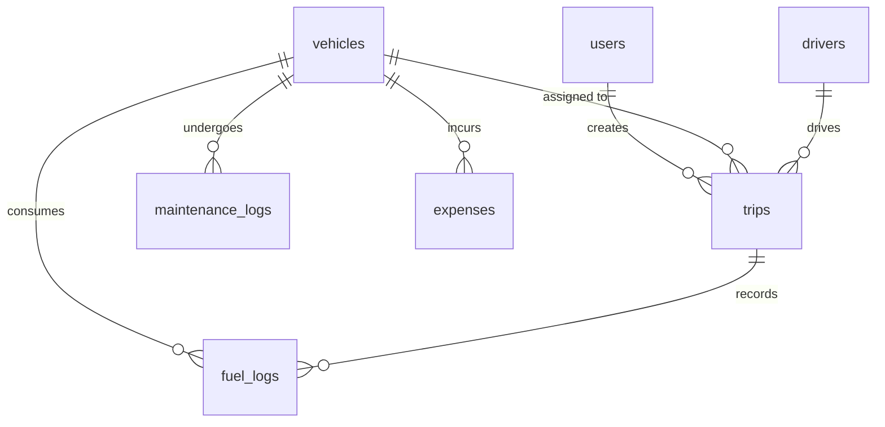

# Data Model Reference

This document describes the SQLAlchemy schema and database relationships.

## Entity ERD & Relationships

---

## 1. User (`users`)
Represents system users with role-based permissions.

| Field | Type | Constraints | Description |
|---|---|---|---|
| `id` | String(36) | Primary Key, UUID | Unique user identifier. |
| `name` | String(255) | Required | Display name of the user. |
| `email` | String(255) | Unique, Indexed, Required | Unique login email. |
| `hashed_password` | String(255) | Required | Bcrypt hashed password. |
| `role` | Enum | Required | One of: `fleet_manager`, `driver`, `safety_officer`, `financial_analyst`. |
| `is_active` | Boolean | Default: `True` | Active account flag. |
| `created_at` | DateTime | Default: `utcnow` | Creation timestamp. |

---

## 2. Vehicle (`vehicles`)
Represents the motorized assets of the fleet.

| Field | Type | Constraints | Description |
|---|---|---|---|
| `id` | String(36) | Primary Key, UUID | Unique vehicle identifier. |
| `registration_number` | String(50) | Unique, Indexed, Required | Registration/license plate number. |
| `name_model` | String(255) | Required | Vehicle model/make description. |
| `type` | String(100) | Required | Vehicle type (e.g. Van, Truck). |
| `max_load_capacity_kg` | Float | Required, > 0 | Maximum payload capacity in kg. |
| `odometer_km` | Float | Default: `0.0` | Current mileage in km. |
| `acquisition_cost` | Float | Default: `0.0` | Cost of vehicle purchase. |
| `status` | Enum | Default: `Available` | One of: `Available`, `On Trip`, `In Shop`, `Retired`. |
| `region` | String(100) | Nullable | Geographic region. |
| `created_at` | DateTime | Default: `utcnow` | Entry creation timestamp. |

---

## 3. Driver (`drivers`)
Represents personnel authorized to drive fleet vehicles.

| Field | Type | Constraints | Description |
|---|---|---|---|
| `id` | String(36) | Primary Key, UUID | Unique driver identifier. |
| `name` | String(255) | Required | Full name. |
| `license_number` | String(50) | Unique, Indexed, Required | Driver license number. |
| `license_category` | String(50) | Required | License class/category. |
| `license_expiry_date` | Date | Required | License expiration date. |
| `contact_number` | String(50) | Nullable | Contact phone number. |
| `safety_score` | Float | Default: `100.0` | Driver safety score rating (0 - 100). |
| `status` | Enum | Default: `Available` | One of: `Available`, `On Trip`, `Off Duty`, `Suspended`. |
| `created_at` | DateTime | Default: `utcnow` | Entry creation timestamp. |

---

## 4. Trip (`trips`)
Represents single cargo transit assignments.

| Field | Type | Constraints | Description |
|---|---|---|---|
| `id` | String(36) | Primary Key, UUID | Unique trip identifier. |
| `source` | String(255) | Required | Origin address/location. |
| `destination` | String(255) | Required | Destination address/location. |
| `vehicle_id` | String(36) | Foreign Key (`vehicles.id`) | Assigned vehicle. |
| `driver_id` | String(36) | Foreign Key (`drivers.id`) | Assigned driver. |
| `cargo_weight_kg` | Float | Required, > 0 | Weight of the cargo in kg. |
| `planned_distance_km` | Float | Required, > 0 | Planned route distance. |
| `actual_distance_km` | Float | Nullable | Actual traveled distance (filled on complete). |
| `fuel_consumed_liters` | Float | Nullable | Fuel consumed (filled on complete). |
| `revenue` | Float | Default: `0.0` | Revenue generated from the trip. |
| `status` | Enum | Default: `Draft` | One of: `Draft`, `Dispatched`, `Completed`, `Cancelled`. |
| `created_by` | String(36) | Foreign Key (`users.id`) | User who created the trip draft. |
| `dispatched_at` | DateTime | Nullable | Time trip was dispatched. |
| `completed_at` | DateTime | Nullable | Time trip was marked completed. |
| `cancelled_at` | DateTime | Nullable | Time trip was cancelled. |
| `created_at` | DateTime | Default: `utcnow` | Draft creation timestamp. |

---

## 5. MaintenanceLog (`maintenance_logs`)
Tracks service actions and workshop events.

| Field | Type | Constraints | Description |
|---|---|---|---|
| `id` | String(36) | Primary Key, UUID | Unique log identifier. |
| `vehicle_id` | String(36) | Foreign Key (`vehicles.id`) | Associated vehicle. |
| `service_type` | String(100) | Required | Type of maintenance (e.g., Oil Change, Repair). |
| `description` | Text | Nullable | Detailed repair description. |
| `cost` | Float | Default: `0.0` | Service cost. |
| `odometer_at_service_km` | Float | Nullable | Vehicle odometer at service time. |
| `status` | Enum | Default: `Open` | One of: `Open`, `Closed`. |
| `opened_at` | DateTime | Default: `utcnow` | Time log was opened. |
| `closed_at` | DateTime | Nullable | Time log was closed. |

---

## 6. FuelLog (`fuel_logs`)
Tracks fuel purchase events per vehicle. Can optionally reference a specific trip.

| Field | Type | Constraints | Description |
|---|---|---|---|
| `id` | String(36) | Primary Key, UUID | Unique log identifier. |
| `vehicle_id` | String(36) | Foreign Key (`vehicles.id`) | Associated vehicle. |
| `trip_id` | String(36) | Foreign Key (`trips.id`), Nullable | Trip during which fuel was filled. |
| `liters` | Float | Required, > 0 | Fuel filled in liters. |
| `cost` | Float | Required, >= 0 | Cost of fuel. |
| `date` | Date | Required | Date of fuel log entry. |
| `odometer_km` | Float | Nullable | Odometer reading during fill. |

---

## 7. Expense (`expenses`)
Tracks other non-fuel operational costs for vehicles.

| Field | Type | Constraints | Description |
|---|---|---|---|
| `id` | String(36) | Primary Key, UUID | Unique expense identifier. |
| `vehicle_id` | String(36) | Foreign Key (`vehicles.id`) | Associated vehicle. |
| `category` | Enum | Required | One of: `Toll`, `Fine`, `Parking`, `Other`. |
| `amount` | Float | Required, > 0 | Expense amount. |
| `date` | Date | Required | Date of expense. |
| `notes` | Text | Nullable | Additional context. |
